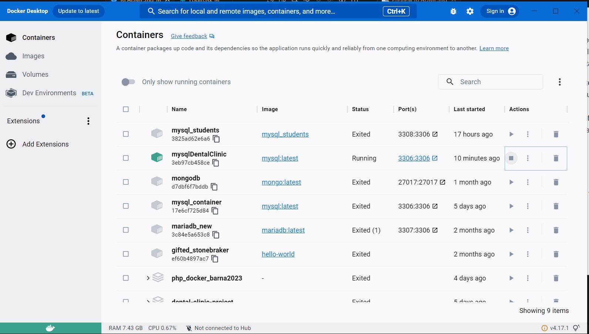

# Dental Clinic project

<details>
  <summary>Content 📝</summary>
  <ol>
    <li><a href="#about">About</a></li>
    <li><a href="#prerequitis">Prerequsitis</a></li>
    <li><a href="#instalation">Instalation</a></li>
    <li><a href="#stack">Stack</a></li>
    <li><a href="#endpoints">Endpoints</a></li>
    <li><a href="#license">License</a></li>
    <li><a href="#webgraphy">Webgraphy</a></li>
    <li><a href="#development">Development</a></li>
    <li><a href="#contact">Contact</a></li>
  </ol>
</details>

## About

This time we are required to generate a front end that connects to our API in charge of managing the business model of a dental clinic.
our API in charge of managing the business model of a dental clinic.

This leads us to think that we will have to be able to generate views
necessary to be able to register and log in as users, an exclusive access area for administrators, individual user profile
exclusive access area for administrators, individual user profile with modifiable user and view and a view in which we will be able to see the current and past appointments we have with the clinic.


## Prerequitis

Taking into account the requirements, we can advise on the views necessary for the correct functioning of the
necessary for the correct functioning of the application.
- User registration.
- User login.
- User profile.
- Appointment search / creation / modification panel.
- View of appointments I have as a client (only my own appointments).
- View of all existing appointments (as a dentist).
- View of all registered users on the platform (as an administrator).


## Docker Connection



## Instalation 

Instalation on local

1. Start the repository
2. `$ npm install`
3. `$ npm create vite@latest . `
4. `$ npm react-router-dom`
5. `$ npm i sass`
6. `$ npm i axios`
7. `$ npm i @reduxjs/toolkit react-redux`
8. `$ npm i cors`
9. `$ npm i react-jwt`
10. `$ npm i react-icons`
11. `$ npm run dev`


## Endpoints

<details>
<summary>Endpoints</summary>
Homa


Login


Admin panel


Appointments panel


</details>

## Stack

Technology used:

<div align="center">
<a href="https://es.react.dev/">
    
</a>
<a href="https://redux.js.org/">
    
</a>
<a href="https://sass-lang.com/">
    
</a>
<a href="https://developer.mozilla.org/es/docs/Web/JavaScript">
    
</a>
<a href="https://www.mysql.com/">
    
</a>

 </div>

## License

This project is under licence of "Antonio Toscano".

## Webgraphy:

To achieve my goal I have collected information from:

link to repositories
link to documentation of external libraries

## Development:

```js
 const developer = "Frontend";

 console.log("Desarrollado por: " Antonio Toscano);
```

## Contact

<a href="https://github.com/A-Toscan" target="_blank"></a>
<a href = "mailto:eltoscan@gmail.com"></a>
<a href="https://www.linkedin.com/in/antonio-toscano-hd/" target="_blank"></a>

</p>
